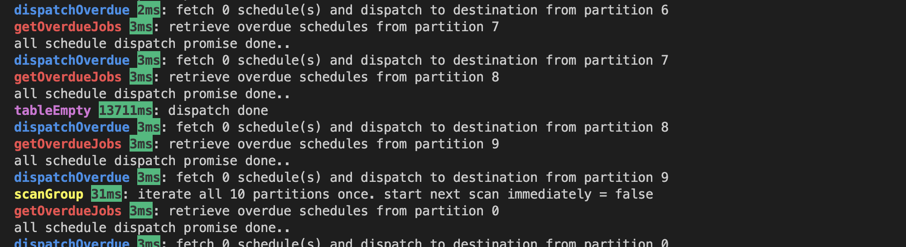
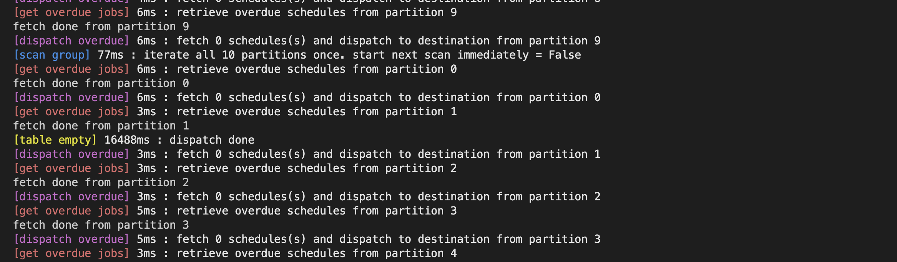
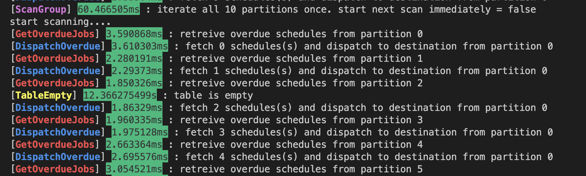
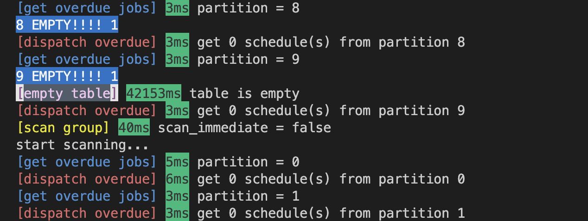

Job Dispatcher Core
===================
여러가지 언어로 job dispatcher core 부분 구현하고 성능 비교하기

local dynamodb
--------------
로컬에서 ddb container 실행
```
docker run -p 8000:8000 amazon/dynamodb-local \
  -jar DynamoDBLocal.jar -sharedDb
```

table 세팅 스크립트 실행
```
node node/ddb_settings --table-name={tableName} --item-count={itemCount}
```
launch program
---------------
node
```
npm install

node index.js
```

python
```
python3 -m venv .venv
source .venv/bin/activate
pip install -r requirements.txt

python3 index.py
```

golang
```
go mod tidy

go run main.go
```

metric 측정
----------
동일한 worker 로직으로 item 1000개, 파티션 10개. 최초로 table Empty가 될 때까지 걸린 시간 측정 (초단위)

#### node

- 13.7
- 16.4
- 15.2
- 15.4
- 18.1
- 14.2
- 11.7
- 14.7
- 14.6
- 14.5

Avg = 14.85

### python

- 16.5
- 17.9
- 16.7
- 14.9
- 14.8
- 15
- 15.6
- 16.3
- 16
- 15

Avg = 15.87

### golang

- 12.4
- 15.1
- 15.1
- 14.8
- 14.1
- 16.2
- 12.5
- 13.6
- 12.7
- 14.8

Avg = 14.13

golang >= node >= python   
IO-bound 작업에서 성능상 유의미한 차이는 없는 것 같다...


### Ruby
sequential 버전 => 42초


비동기 기능을 하나도 사용하지 않았을 경우 3배 정도 더 오래걸렸다.


